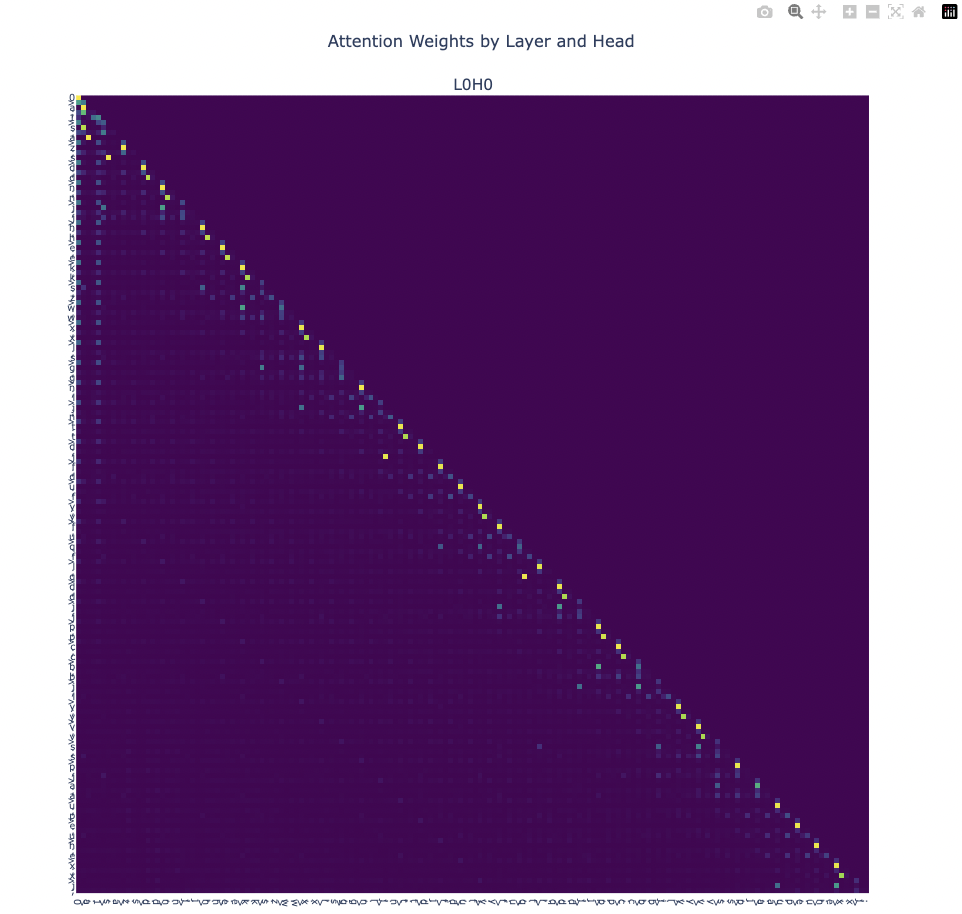

# Examples

## Variable Renaming

To run a simple training job:
```bash
python -m examples.var_rename
```

### Grid Search with Tmux
To run a grid search over different hyperparameters:
```bash
#!/bin/bash

# Launches a grid of sweeps on different GPUs. Usage (from the root directory):
# chmod +x <path>/launch_var_rename_sweep.sh
# <path>/launch_var_rename_sweep.sh

# CONFIGURATION
n=8  # number of grid cells
GPUs=(0 1 2 3 4 5 6 7)  # List of available GPUs

# define your sweep parameters
sweeps[0]="--num_layers=1 --num_heads=4"
sweeps[1]="--num_layers=2 --num_heads=4"
sweeps[2]="--num_layers=3 --num_heads=4"
sweeps[3]="--num_layers=4 --num_heads=4"
sweeps[4]="--num_layers=4 --num_heads=1"
sweeps[5]="--num_layers=4 --num_heads=2"
sweeps[6]="--num_layers=2 --num_heads=2"
sweeps[7]="--num_layers=3 --num_heads=2"

SESSION_NAME="var_rename_sweep"

# kill existing session if needed
tmux kill-session -t $SESSION_NAME 2>/dev/null

# calculate grid dimensions (rows and cols)
cols=$(awk "BEGIN { print int(sqrt($n)) }")
rows=$(( (n + cols - 1) / cols ))  # ceil(n / cols)

# create new session
tmux new-session -d -s $SESSION_NAME -x "$(tput cols)" -y "$(tput lines)"
tmux rename-window -t $SESSION_NAME "sweeps"

# first pane is already created (pane 0)
pane_ids=()
pane_ids+=("0")

# create grid: split rows first
for ((i = 1; i < rows; i++)); do
    tmux split-window -v -t $SESSION_NAME:0.0
    tmux select-layout -t $SESSION_NAME tiled
done

# for each row, split horizontally into columns
for ((i = 0; i < rows; i++)); do
    for ((j = 1; j < cols; j++)); do
        tmux select-pane -t $SESSION_NAME:0.$((i * cols))
        tmux split-window -h -t $SESSION_NAME
        tmux select-layout -t $SESSION_NAME tiled
    done
done

# assign sweeps to panes
for ((i = 0; i < n; i++)); do
    gpu_index=$((i % ${#GPUs[@]}))
    gpu=${GPUs[$gpu_index]}
    cmd="CUDA_VISIBLE_DEVICES=$gpu python -m examples.var_rename ${sweeps[$i]} --run_name=sweep_${i}"
    tmux send-keys -t $SESSION_NAME:0.$i "$cmd" C-m
done

# attach to session
tmux attach -t $SESSION_NAME
```

### Visualizing results
First, load your model and prompter:
```python
from iluvattnshun.utils import load_checkpoint, load_config_from_yaml

config_path = "<path>/run_<id>/run_<id>.yaml"
ckpt_path = "<path>/run_<id>/ckpt_epoch_<epoch>.pt"

config = load_config_from_yaml(config_path, VariableRenamingConfig)
prompter = VariableRenamingPrompter(config)

model = MultilayerTransformer(
    vocab_size=39,
    d_model=config.dim_model,
    n_heads=config.num_heads,
    n_layers=config.num_layers,
)

load_checkpoint(ckpt_path, model)
model.eval()
```

Then, you can view your the results on a sample prompt:
```python
import numpy as np
import torch

rng = np.random.default_rng()
prompt, answer, metadata = prompter.get_prompt(rng)

with torch.no_grad():
	x = torch.tensor(prompter.tokenize(prompt)).unsqueeze(0)
    logits, _, attn_weights, _ = model.forward(x, return_attn_weights=True)
	pred = prompter.detokenize(logits[0].argmax(dim=-1).tolist())

	print("prompt: ", prompt)
	print("pred:   ", pred)
	print("answer: ", answer)
```

Example output:
```
prompt:  1>o;o>n;n>i;0>k;i>p;k>f;f>o;o>g;g>c;p>e;c>j;j>z;e>v;v>e;e>p;z>m;m>s;s>x;p>i;i>t;t>w;x>d;w>j;j>l;l>k;k>o;o>g;
pred:    111111111111000111110000010100010001111101010001111011101110010100010101101010111011010110111011111111111111
answer:  1.1.1.1.1.1.0.0.1.1.0.0.0.0.0.0.0.0.1.1.0.0.0.0.1.1.1.1.1.1.0.0.0.0.0.0.1.1.1.1.1.1.0.0.1.1.1.1.1.1.1.1.1.1.
```

Finally, you can visualize the attention weights with plotly:
```python
weights = [attn_weight.detach().cpu().numpy()[0] for attn_weight in attn_weights]
plotly_fig = get_fig(weights, list(prompt))
plotly_fig.show()
```



