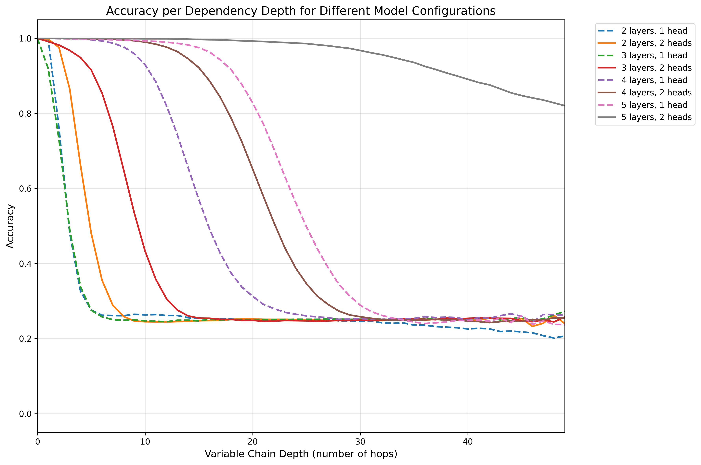

# Transformer Depth Unlocks $O(2^n)$ Effective Context Size with Divide and Conquer
When discussing bottlenecks in transformer context size, we typically focus on position embeddings, the quadratic complexity of attention, and memory constraints. But there's a subtler, equally important limitation hidden in plain sight: the depth of recursive reasoning.

Let's start with a fun brain teaser. In the codebase below, a segfault occurs downstream of function `f1035()`. Which function caused the bug?
```python
def f1086(): # code may cause segfault
def f1013(): # code may cause segfault
def f1017(): f1086()
def f1094(): f1013()
def f1028(): f1017()
def f1031(): f1028()
def f1003(): f1094()
def f1014(): f1003()
def f1035(): f1031()
def f1081(): f1014()
```

If you said `f1086()`, you're correct! But how did you do it? Chances are, you either tracked evaluations as you read from top to bottom or followed the code path from the bottom up. The key is that it's impossible to know `f1086()` matters until you know `f1017()` matters, and so on. To access relevant sources of truth in code, novels, legal documents, or even X feeds, humans (or networks) must efficiently recall what depends on what. While it is true that a token in a decoder-only attention layer *can* attend to any prior token, it's unlikely that it will attend to the correct piece of information in one go.

Much of this work is inspired by the [Variable Scope](https://variablescope.org/) project, in which Wu, Geiger, and Millière investigated the following variable evaluation task:

```
a=1
b=2
c=a
d=c
e=b
...
```

Patching the residual stream, they found that information flows from one token to another with each layer, iteratively resolving the dependencies one layer at a time. In the first few layers, the token `b` might store "b is 2" in its activation, and in the next layer, the token `e` might attend to `b` and store "e is 2" in its activation, and so on. Another cool paper by [Prakash et al.](https://arxiv.org/abs/2505.14685) describes a "lookback mechanism" in which information flows across dependencies from earlier to later layers.

(include a diagram of hypothesized information flow)

This all had me wondering: what is the relationship between the number of layers and the *maximum* number of dependencies a token can encode? At first glance the relationship seems linear, as each layer allows the query token to reach a subsequent dependency. As complexity of the prompt increases, the effective context size shrinks linearly. On complex codebases or long novels, this result would be especially concerning for modern LLMs, which only have layer depths on the order of 60-120 (insert your favorite reddit leak here).

But what if the transformer learns to *divide and conquer*? If each token resolves its own dependencies in parallel, then it might be possible to achieve exponential effective context size with respect to layer depth. In this post, I show that this is indeed the case:
1. With the right formulation, transformers can resolve $Ω(2^n)$ dependencies for $n$ stacked attention layers.
2. Modern LLMs do not exhibit this exponential behavior and instead rely on tool use or chain of thought reasoning to resolve dependencies sequentially.

## Variable Evaluation Experiment

I generated a variable evaluation dataset with an updated objective, trained models of various depths and heads, and analyzed the attention maps to see how the model resolves dependencies in parallel.

### Task Design
I made some changes to the original variable binding task to simplify learning and improve interpretability:
- The task requires the model to evaluate `b>a` instead of `a=b` to improve interpretability of the attention maps, as it allows variable `b` to directly attend to `a` during evaluation.
- Each example consists of variable renaming chains like `1>a;2>b;a>c;b>d;d>e;`, where the model must predict the original numeric value at each variable token, improving sample efficiency.
- Variables (sampled from a-z) may be reused by another chain once they are reassigned.
- Accuracy is tracked and reported with respect to dependency depth (0-hops, 1-hop, 2-hops, etc.)

```
Prompt:    2>l;0>c;1>f;3>p;c>u;u>s;s>n;p>w;l>o;o>e;n>u;f>k;
Answer:    2.2.0.0.1.1.3.3.0.0.0.0.0.0.3.3.2.2.2.2.0.0.1.1.
Predicted: 2.2.0.0.1.1.3.3.0.0.0.0.0.0.3.3.2.2.2.2.0.0.2.2.
Correct:   ✔.✔.✔.✔.✔.✔.✔.✔.✔.✔.✔.✔.✔.✔.✔.✔.✔.✔.✔.✔.✔.✔.✘.✘.
```

Above, I included an example prompt, the correct answers, example predictions, and whether those predictions were correct. I don't want to bore you with the details, but feel free to read through the prompt generation code below:

[VariableRenamingPrompter](var_rename.py#VariableRenamingPrompter)

### Model Architecture
I use a pre-LayerNorm transformer with RoPE positional embeddings, testing configurations from 2-5 layers and 1-2 heads. The vocabulary size is 39 tokens (digits 0-9, letters a-z, symbols `>`, `;`, `.`).


### Experimental Parameters
- Training: 1M examples with 150 renames each, 10K test examples
- Batch size: 128, Learning rate: 1e-4 with 4K warmup steps
- Hyperparameter sweep: 8 configurations testing layer depth (2,3,4,5) × attention heads (1,2)

[Default Training Parameters](var_rename.py#L312-342)

### Experiment Results

Below is a table summarizing overall accuracy with respect to the number of layers and attention heads after training for 8 days on NVIDIA 2080 GPUs. The results show that more layers improves accuracy, and adding an additional head brings further improvements in performance.

| Hyperparameters   | Value   | Step | Wallclock       |
|-------------------|---------|------|-----------------|
| 2 layers, 1 head  |  0.3131 |  853 | 8d 2h 30m 4s    |
| 2 layers, 2 heads |  0.3466 |  889 | 8d 2h 29m 25s   |
| 3 layers, 1 head  |  0.3086 |  702 | 8d 2h 26m 32s   |
| 3 layers, 2 heads |  0.4229 |  578 | 8d 2h 37m 40s   |
| 4 layers, 1 head  |  0.5541 |  570 | 8d 2h 38m 25s   |
| 4 layers, 2 heads |  0.6672 |  448 | 8d 2h 28m 51s   |
| 5 layers, 1 head  |  0.7195 |  463 | 8d 2h 40m 27s   |
| 5 layers, 2 heads |  0.9765 |  279 | 8d 2h 0m 26s    |


However, what is more interesting is how model performance per depth changes with respect to the number of layers. The results are shown below, where the x-axis is the number of hops (i.e., how many renames away from the original variable) and the y-axis is accuracy. This data was similarly taken after training for 8 days and 2 hours.



For the data with two heads, we can clearly observe an exponential relationship between the number of layers and the performance per chain depth. The two layer model experiences regresses from perfect accuracy at 2 hops to baseline at 8 hops, the three layer model drops in performance from 4 to 13 hops, the four layer model declines from perhaps 10 to 29 hops, and the five layer model begins to decline perhaps in the low 20s.

Generally, the one head experiments converged much slower or, in the case of the five layer 1 head experiment, have not yet converged. Moreover, it is worth noting that the three layers 1 head regressed heavily at 684 steps, likely due to instability caused. I hypothesize why this is the case [here](#head-patching).

## The Divide and Conquer Mechanism
So how does this tiny transformer achieve exponentially improving performance with respect to the number of layers? The key is that the model learns a divide and conquer copy circuit, where *every* token resolves an independent dependency in parallel, as opposed to only the query token at the end.

Before diving into attention maps, I'd like to summarize the patterns I found:
- First layer handles `b` to `b` in `a>b;...;b>c` as well as captures whether a variable occurs after a `>` or `;`
- Second layer relaxes 

### Attention Maps
In this section, I analyze the attention maps of a 5 layer, 2 head transformer after 284 epochs on the prompt generated with seed `42`, which it predicts with 100% accuracy. For context, the maximum chain depth in this prompt is 43 at `n>h;`.
```
Prompt:
2>l;0>c;1>f;3>p;c>u;u>s;s>n;p>w;l>o;o>e;n>u;f>k;u>n;e>l;w>c;k>x;c>v;n>g;x>d;g>s;l>b;s>l;l>r;r>t;v>k;b>n;k>p;p>u;d>y;y>i;t>k;n>x;x>b;b>v;u>m;m>s;v>h;s>p;i>y;h>d;k>q;y>c;d>u;q>k;k>w;u>x;x>g;c>r;p>v;v>t;t>u;w>t;r>l;l>h;t>o;g>n;h>a;u>g;g>l;a>s;n>w;s>b;o>p;b>o;o>b;b>u;w>o;l>h;o>z;h>g;z>y;p>a;g>v;v>t;y>x;x>k;u>d;d>o;a>z;o>j;k>l;z>h;t>i;i>c;c>u;j>s;l>r;u>x;s>y;x>l;y>m;r>d;d>g;g>t;m>q;t>z;l>i;i>j;h>k;k>m;q>l;z>t;m>f;f>g;l>v;t>s;s>b;j>m;g>d;b>s;m>r;s>u;v>n;r>l;d>a;a>m;n>r;u>g;r>d;d>c;c>r;l>u;g>v;u>d;v>f;f>s;d>q;q>d;r>v;d>h;m>z;v>k;s>p;k>g;h>d;z>l;p>n;l>b;d>j;n>s;s>m;b>e;g>p;m>v;v>y;y>n;p>w;n>h;j>l;e>a;
Answer:
2.2.0.0.1.1.3.3.0.0.0.0.0.0.3.3.2.2.2.2.0.0.1.1.0.0.2.2.3.3.1.1.3.3.0.0.1.1.0.0.2.2.0.0.0.0.0.0.3.3.2.2.3.3.3.3.1.1.1.1.0.0.2.2.2.2.2.2.3.3.3.3.2.2.3.3.1.1.2.2.0.0.1.1.2.2.0.0.0.0.2.2.2.2.1.1.3.3.3.3.3.3.0.0.1.1.1.1.0.0.2.2.1.1.3.3.3.3.1.1.2.2.1.1.0.0.1.1.1.1.1.1.2.2.3.3.2.2.3.3.2.2.0.0.3.3.3.3.2.2.2.2.1.1.1.1.0.0.1.1.2.2.0.0.3.3.3.3.3.3.1.1.2.2.3.3.1.1.3.3.1.1.2.2.2.2.2.2.1.1.2.2.3.3.3.3.0.0.0.0.1.1.2.2.0.0.0.0.1.1.2.2.2.2.3.3.0.0.2.2.3.3.2.2.1.1.3.3.0.0.0.0.1.1.2.2.1.1.1.1.1.1.3.3.2.2.3.3.2.2.2.2.3.3.3.3.1.1.3.3.0.0.1.1.2.2.1.1.3.3.0.0.2.2.0.0.3.3.2.2.2.2.0.0.1.1.2.2.2.2.2.2.1.1.2.2.3.3.0.0.
Predicted:
222100011111333100000000000133312221222200001111000022223333111133310000111100002222000000000000333322223330333311111111000022222222222033303330222233331110222200001110222200000003222223221111333333333030000011101010000022221113333333331111222211110000111110111011222133302221333322230000333330332222202211111111000011112222000033303033303311112221333311133333111122222222222211112222333333330000000011112222000002001111222222223332000022223333222211113333000002021111222011101010101033322222333222202223333230321110333200021111222211123332000222230002333322222023000011122222232323231112232333330000
Right:
✔.✔.✔.✔.✔.✔.✔.✔.✔.✔.✔.✔.✔.✔.✔.✔.✔.✔.✔.✔.✔.✔.✔.✔.✔.✔.✔.✔.✔.✔.✔.✔.✔.✔.✔.✔.✔.✔.✔.✔.✔.✔.✔.✔.✔.✔.✔.✔.✔.✔.✔.✔.✔.✔.✔.✔.✔.✔.✔.✔.✔.✔.✔.✔.✔.✔.✔.✔.✔.✔.✔.✔.✔.✔.✔.✔.✔.✔.✔.✔.✔.✔.✔.✔.✔.✔.✔.✔.✔.✔.✔.✔.✔.✔.✔.✔.✔.✔.✔.✔.✔.✔.✔.✔.✔.✔.✔.✔.✔.✔.✔.✔.✔.✔.✔.✔.✔.✔.✔.✔.✔.✔.✔.✔.✔.✔.✔.✔.✔.✔.✔.✔.✔.✔.✔.✔.✔.✔.✔.✔.✔.✔.✔.✔.✔.✔.✔.✔.✔.✔.✔.✔.✔.✔.✔.✔.✔.✔.✔.✔.✔.✔.✔.✔.✔.✔.✔.✔.✔.✔.✔.✔.✔.✔.✔.✔.✔.✔.✔.✔.✔.✔.✔.✔.✔.✔.✔.✔.✔.✔.✔.✔.✔.✔.✔.✔.✔.✔.✔.✔.✔.✔.✔.✔.✔.✔.✔.✔.✔.✔.✔.✔.✔.✔.✔.✔.✔.✔.✔.✔.✔.✔.✔.✔.✔.✔.✔.✔.✔.✔.✔.✔.✔.✔.✔.✔.✔.✔.✔.✔.✔.✔.✔.✔.✔.✔.✔.✔.✔.✔.✔.✔.✔.✔.✔.✔.✔.✔.✔.✔.✔.✔.✔.✔.✔.✔.✔.✔.✔.✔.✔.✔.✔.✔.✔.✔.✔.✔.✔.✔.✔.✔.✔.✔.✔.✔.✔.✔.✔.✔.✔.✔.✔.✔.✔.✔.✔.✔.✔.✔.
```

#### Layer 1 Attention Maps
As per standard, tokens along the y axis attend to tokens along the x axis. Black squares are where the normalized attention probability gets too small to matter. You may explore both heads' attention maps by scrolling left and right. You may also select a region you'd like to magnify and double click to return to the original zoom.

[Layer 1 Attention Maps](l1_attn_map.html)

Let's start by examining how both maps treat the **first variable in an assignment operator** (e.g. `x` in `x>y;`). Specifically zoom to the top ~20 characters of the first map and observe the path where `0>c;...;c>u`. If you view the row of the second `c`, you can observe that it attends primarily to the first `c` that appears before it. Something similar happens in the second head for `c`, but if you zoom out, it appears specialize at different relative distances. Together, they discover most self-to-self relationships, passing the embedding of the former to the latter, thereby giving the second instance the relative *position* of the first (this will come handy later!). The fact that *both* heads learned slightly different lookback ranges is somewhat of a mystery to me, but it's likely a function of the RoPE base not being fully calibrated and rotational finessing to avoid the case where a letter attends to a stale instance of same letter in a different chain.

Now let's see how the **second variable in an assignment operator** (e.g. `y` in `x>y;`) gets treated. I initially thought `y` should always attend to `x` using relative positions, but `y` has no way of telling whether the character two before it belongs to the `x>y` assignment or `x;y` sequence, the latter of which might assign `y` to an `x` of a different chain. As such, both heads seem to encode positional information: head 1 makes `y` attend to preceding `;` and `>` instances, and head 2 makes `y` attend strongly to preceding `>` instances at 12, 20, . This lets future layers know that `y` is the one getting assigned and not the one doing the assigning.

While not too important for this analysis, another interesting pattern is that `>` and `;` tokens throughout the sequence tend to attend to all numerical tokens and other `>` and `;` tokens to some degree, creating the striking lattice pattern. I hypothesize that this serves (or once served) as a fallback mechanism for when the model needs to make an educated guess. The numerical tokens themselves aren't that intresting to analyze, as the residual pathway will ensure their identity is always present.

#### Layer 2 Attention Maps

[Layer 2 Attention Maps](l2_attn_map.html)

Layer 2 is interesting because the second head appears much more information dense than the first. We can confirm that the second head is much more important than the first by patching the heads and examining performance regressions (see [here](#head-patching)).

We can start by observing how all tokens in `2>l`, `0>c`, `1>f`, and `3>p` attend directly to the relevant number of the operation. Afterwards, we see an interesting pattern emerge where the assigner attends directly to its parent. Take the example `c` from last time. It likely used the relative position of the first `c` during its assignemnt to determine that it should attend directly to `0` in the second layer. However the `>` and `u` tokens have no way of knowing to attend to `0` and thus attend to the second `c`, gaining its information from the first attention layer. If you zoom out you'll see this exact attention pattern everywhere.

However, there are some fascinating exceptions. For instance, see `c>u;u>s;s>n`. In head 2, all variables in this sequence attend to the second `c`, with some of which assigning slight weight to `3`, which is part of another chain. Moreover, head 1 appears to break from its regular structure and "back up" the first instances of `n` and `s` by attending more safely to their direct assigner (`u` and `s` in this case). Someohow, maybe exploiting a sparse signal detected from the previous layer, the model knows to *guess* ahead... and it turns out to be right!

## LLMs Don't Learn this Behavior
Try on existing one
- Attempts to use python or does it in chain of thought. Fails if you ask it to direclty do it without reasoning early on.

- Existing research suggests models do this linearly...

## Why this Matters (and What's Next...)

## Acknowledgements

## Appendix
### Pro Tips that (Probably) Helped (maybe move up?)
- RoPE (big time, and setting the base slightly lower)
- The formulation enforces training on various lengths
- Ensuring number of chains is large enough

### Head Patching
